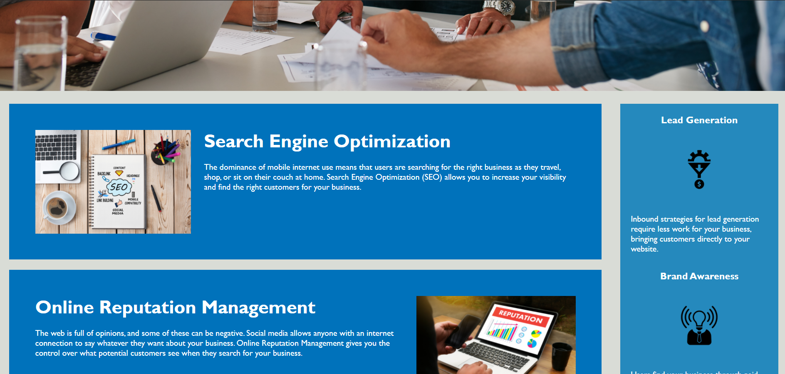
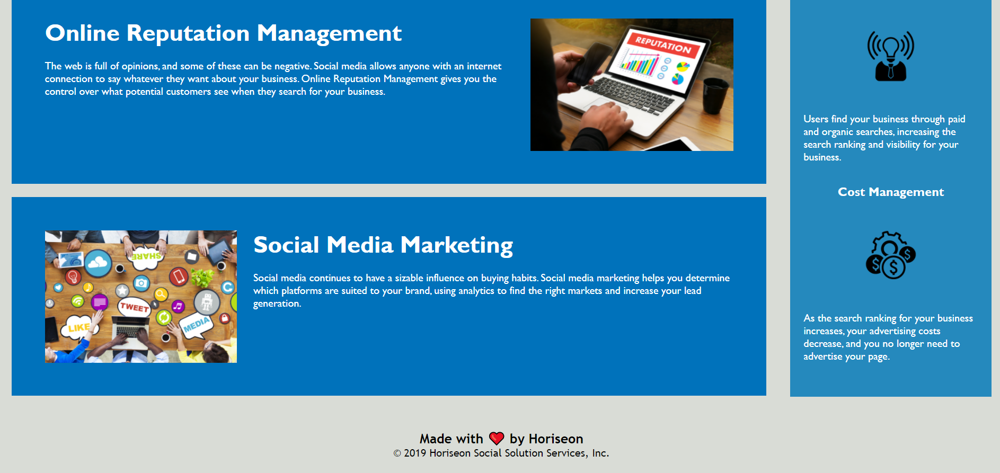

# Horiseon

Horiseon is a website that provides helpful tips and information to help you implement a marketing strategy and grow your business.

## Table of Contents

### Main

- Search Engine Optimization

- Online Reputation Management

- Social Media Marketing

### Aside

- Lead Generation

- Brand Awareness

- Cost Management

## Built With

- HTML

- CSS

## Screenshots

## Credits

Refractored starter code from Horiseon.

## License

MIT &copy; Marco Avila
