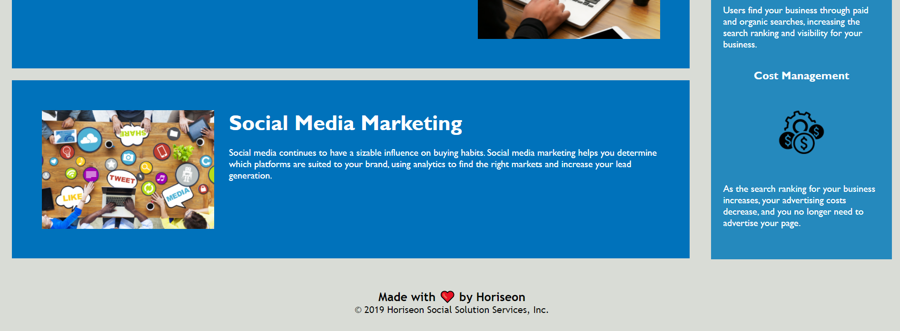

# Horiseon

Horiseon is a website that provides helpful tips and information to help you implement a marketing strategy and grow your business.

## Table of Contents

### Main

- Search Engine Optimization

- Online Reputation Management

- Social Media Marketing

### Aside

- Lead Generation

- Brand Awareness

- Cost Management

## Built With

- HTML

- CSS

## Changes Applied

Refractored the code to make it more efficient as well as easier to read. Changed div elements to more specific selectors. Consolidated repetitive code in CSS stylesheet. Removed several unnecessary classes within HTML elements. Added informative comments within the HTML and CSS pages. Added alt text to all images in the HTML page to improve accessibility. Properly linked nav section to the corresponding section in page when clicked. Added proper indentation and cascading style to better organize the code and apply styles with specificity in mind.

## Screenshots

## Credits

Refractored starter code from Horiseon.

## License

MIT &copy; Marco Avila
